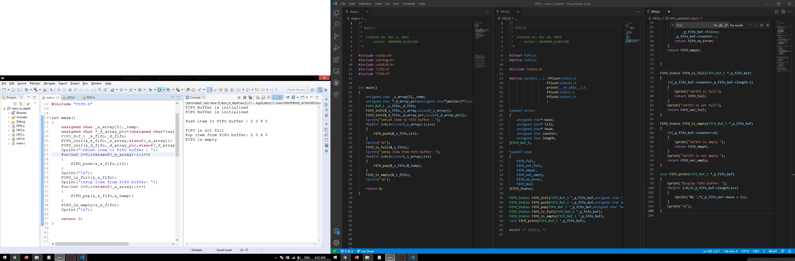
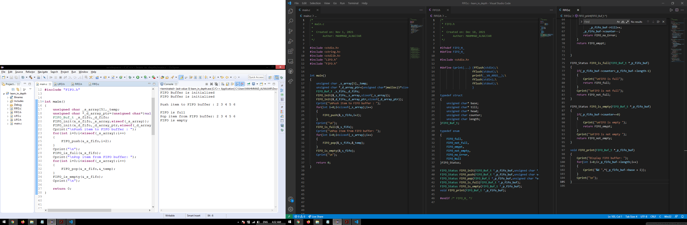

## **Write C Program to Create a FIFO buffer** 

**In This Assigment we use create a buffer by array and other created buffer run Time**

A FIFO is a special type of buffer. The name FIFO stands for first in first out and means that the data written into the buffer first comes out of it first. There are other kinds of buffers like the LIFO (last in first out), often called a stack memory, and the shared memory.

  
Consol_Output 
| Array FIFO Buffer |
| ----------------- |
||
| dynamic FIFO Buffer |
|