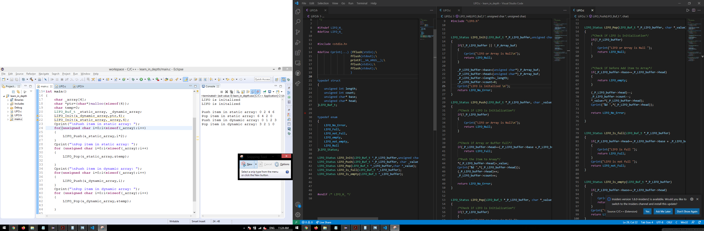

## **Write C Program to Create a FIFO buffer** 

LIFO is an abbreviation for last in, first out. It is a method for handling data structures where the first element is processed last and the last element is processed first.

  
Consol_Output 
| dynamic LIFO Buffer |
|