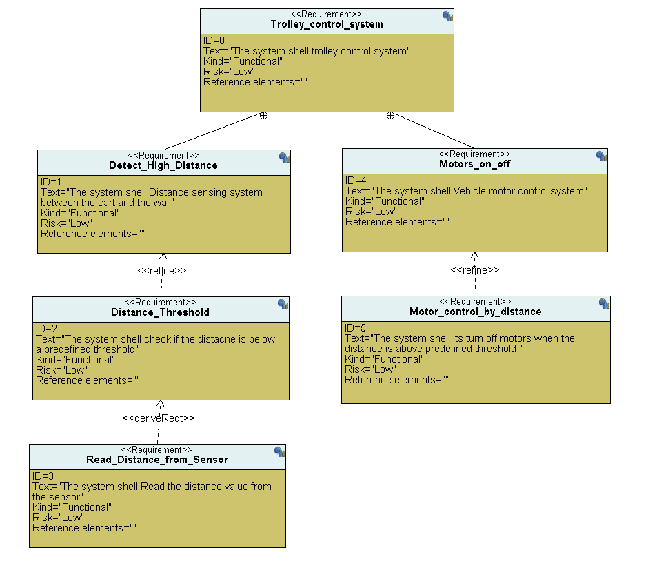
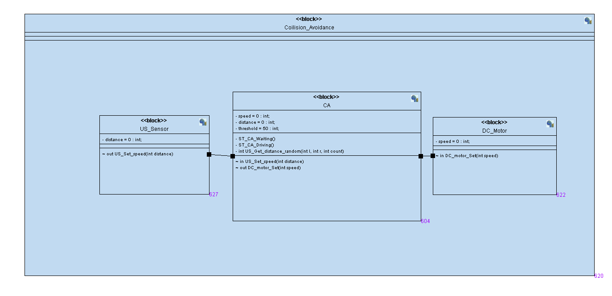
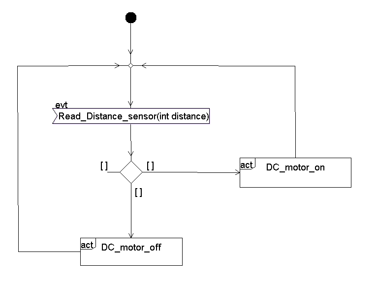
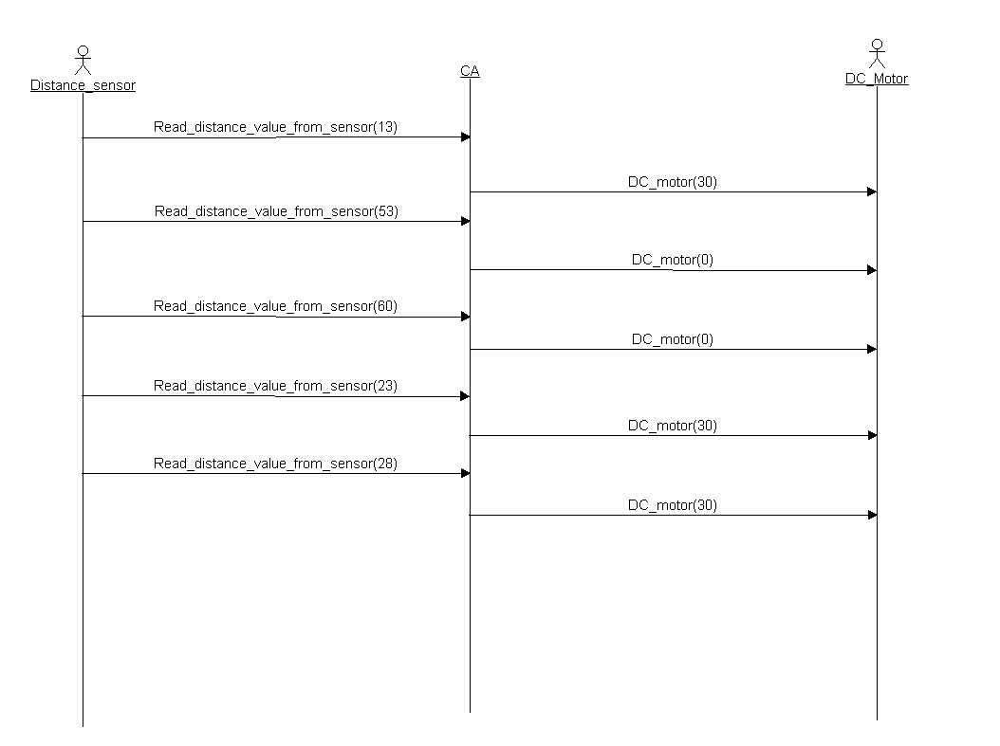
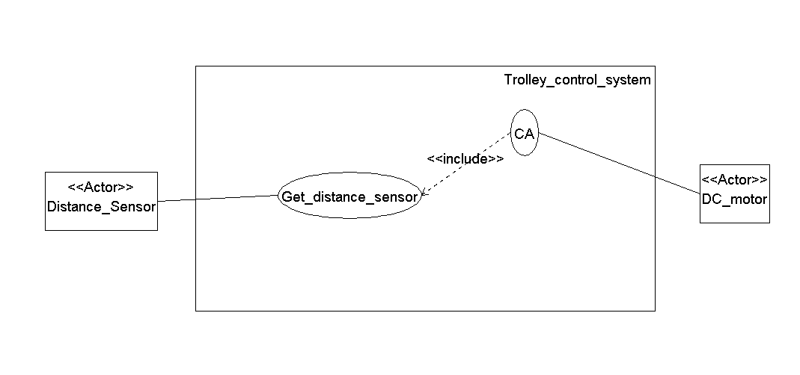
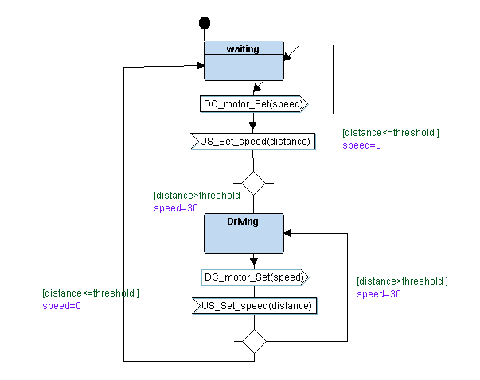
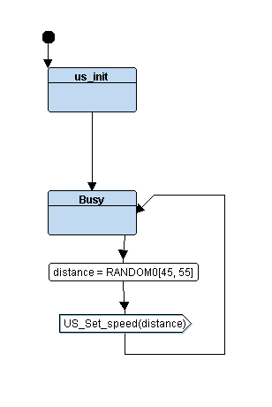

## **Here we have designed blocks and logical design and SW logical verification each fıle or modul By TTool**

|Requirments|
| --------- |
||

|Blocks|
| --------- |
||

|Active_Diagram|
| --------- |
||

|Sequence_Diagram|
| --------- |
||

|Use_case_Diagram|
| --------- |
||

|Middle Layer Logical Design|
| --------- |
||

|Motor Logical Design|
| --------- |
||

|Ulatrasonic Logical Design|
| --------- |
||

